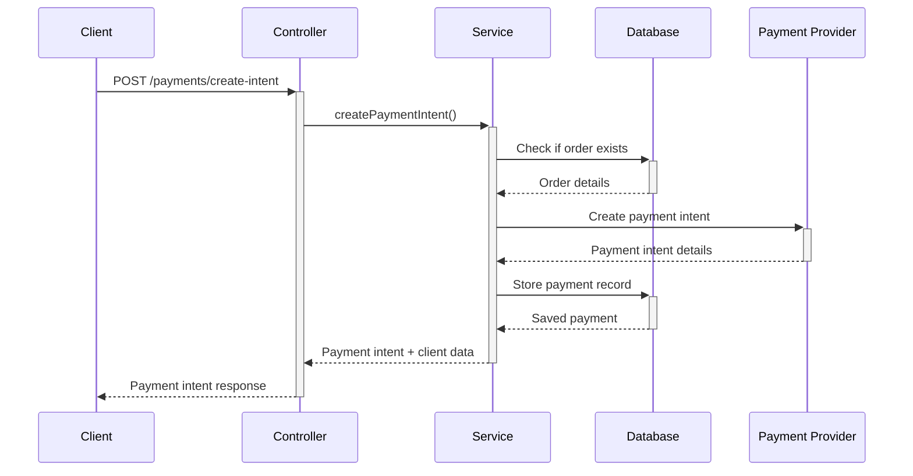
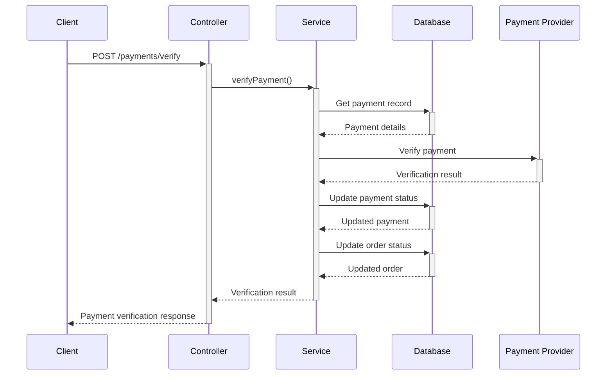
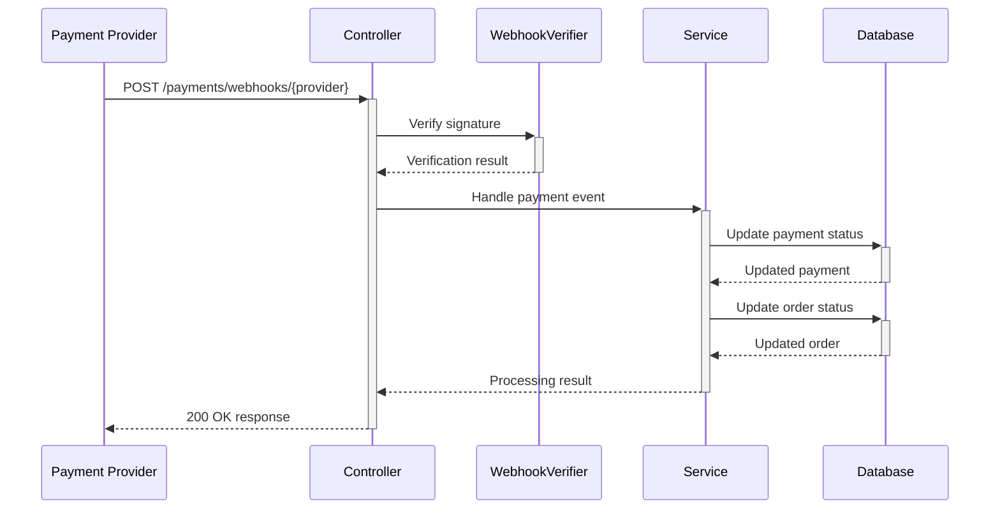

# Payment Module Documentation

The Payment module manages all payment-related operations in the e-commerce platform, supporting multiple payment providers with a secure and scalable architecture.

## Features

- Support for multiple payment providers (Stripe, Razorpay, UPI, COD)
- Payment intent creation
- Payment verification
- Refund processing
- Secure webhook handling for payment notifications
- Comprehensive logging and error handling

## Architecture

The payment module follows a layered architecture:

1. **Controller Layer**: Handles HTTP requests and routes them to the appropriate service methods
2. **Service Layer**: Contains the business logic for payment processing
3. **Integration Layer**: Abstracts the communication with external payment providers
4. **Data Layer**: Interacts with the database through Prisma ORM

## Payment Flow

### Creating a Payment Intent



### Verifying a Payment



### Webhook Processing



## API Endpoints

- **POST /payments/create-intent**: Create a payment intent for an order
- **POST /payments/verify**: Verify a payment
- **POST /payments/refund**: Process a refund
- **GET /payments/:id**: Get payment details by ID
- **GET /payments/order/:orderId**: Get all payments for an order
- **POST /payments/webhooks/stripe**: Webhook endpoint for Stripe events
- **POST /payments/webhooks/razorpay**: Webhook endpoint for Razorpay events

## Security Measures

The payment module implements several security measures:

1. **Authentication**: All endpoints except webhooks require JWT authentication
2. **Webhook Verification**: All webhook payloads are cryptographically verified
3. **Rate Limiting**: Prevents abuse of payment endpoints
4. **Validation**: Input validation using DTOs and class-validator
5. **Error Handling**: Comprehensive error handling with appropriate HTTP responses
6. **Logging**: Detailed logging for audit and debugging

## Testing

- Unit tests for service methods
- Integration tests for API endpoints
- Mock implementations for payment providers

## Usage Examples

### Creating a payment intent

```typescript
// Example request
const createPaymentIntentDto = {
  orderId: '123e4567-e89b-12d3-a456-426614174000',
  amount: 299.99,
  currency: 'USD',
  paymentMethod: PaymentMethod.CREDIT_CARD,
  provider: PaymentProvider.STRIPE
};

// API call
const paymentIntent = await paymentsService.createPaymentIntent(createPaymentIntentDto);
```

### Verifying a payment

```typescript
// Example request
const verifyPaymentDto = {
  paymentId: '123e4567-e89b-12d3-a456-426614174000',
  providerPaymentId: 'pi_123456789',
  signature: 'signature_from_provider'  // For providers that use signatures
};

// API call
const verificationResult = await paymentsService.verifyPayment(verifyPaymentDto);
```

### Creating a UPI payment intent

```typescript
// Example request for UPI payment
const createUpiPaymentIntentDto = {
  orderId: '123e4567-e89b-12d3-a456-426614174000',
  amount: 2999.99,
  currency: 'INR',
  paymentMethod: PaymentMethod.UPI,
  provider: PaymentProvider.UPI
};

// API call
const upiPaymentIntent = await paymentsService.createPaymentIntent(createUpiPaymentIntentDto);

// Example response
{
  id: "payment_uuid",
  orderId: "123e4567-e89b-12d3-a456-426614174000",
  amount: 2999.99,
  currency: "INR",
  status: "PENDING",
  provider: "UPI",
  clientData: {
    virtualPaymentAddress: "merchant_id@upi",
    upiUrl: "upi://pay?pa=merchant_id@upi&pn=YourStore&am=2999.99&cu=INR&tn=Order-123e4567",
    qrCode: "https://api.qrserver.com/v1/create-qr-code/?size=200x200&data=upi://pay..."
  }
}
```

## Supported Payment Providers

- Stripe
- Razorpay
- Cash on Delivery (COD)
- UPI (Unified Payments Interface)

## Important Payment Events

The payments module handles various payment events from payment providers, including:

1. **Payment Success** (`payment_intent.succeeded`, `payment.captured`)
2. **Payment Failure** (`payment_intent.payment_failed`, `payment.failed`) 
3. **Payment Requires Action** (`payment_intent.requires_action` - for 3D Secure, etc.)
4. **Full Refund** (Full amount refunded via `charge.refunded`)
5. **Partial Refund** (Partial amount refunded via `charge.refunded`)

### Handling Special Payment Cases

#### 1. Payment Requires Additional Action (e.g., 3D Secure)

When a payment requires additional authentication (like 3D Secure), Stripe sends a `payment_intent.requires_action` event. The system will:

1. Update the payment status to PENDING
2. Store the next action data in the payment metadata
3. Make action details available to the frontend for redirecting users to authentication

Frontend applications should check for the `requiresAction: true` flag in payment responses and handle the authentication flow accordingly, typically by redirecting users to the authentication page specified in `nextActionUrl`.

#### 2. Partial Refunds

When processing partial refunds, the payment system:

1. Keeps the order status as is (not changing to REFUNDED)
2. Updates payment metadata with refund information
3. Stores both the refunded amount and total amount for tracking
4. For partial refunds, metadata will include `refunded: false` and `refundAmount` with the partial amount

## Webhook Integration

Payment providers send webhooks to notify the application about payment events. The application implements webhook handlers for each supported payment provider.

### Stripe Webhooks

Stripe webhooks are received at `/payments/webhooks/stripe` and handle the following events:

- `payment_intent.succeeded`
- `payment_intent.payment_failed`
- `payment_intent.requires_action`
- `charge.refunded` (both full and partial refunds)

### Razorpay Webhooks

Razorpay webhooks are received at `/payments/webhooks/razorpay` and handle the following events:

- `payment.captured`
- `payment.failed`
- `refund.processed`

## Implementation Details

Each payment provider is implemented as a separate provider class that implements the `PaymentProviderInterface`. This allows for consistent payment processing regardless of the provider used.

```typescript
export interface PaymentProviderInterface {
  createPaymentIntent(dto: CreatePaymentIntentDto): Promise<Record<string, any>>;
  verifyPayment(payment: any, providerPaymentId: string, signature?: string): Promise<PaymentResult>;
  processRefund(payment: any, amount?: number, reason?: string): Promise<PaymentResult>;
}
```

## Security and Data Protection

Payment data is protected using encryption for sensitive information. Credit card details are never stored in plain text, and the system uses the `PaymentEncryptionUtil` to encrypt and decrypt sensitive payment information.

Make sure to set the `PAYMENT_ENCRYPTION_KEY` in your environment variables for production use.

## Real SDK Integration

When integrating real payment SDKs, ensure that:

1. All relevant events are handled (including those listed above)
2. Error cases are properly managed with appropriate logging
3. Idempotency keys are used for payment operations to prevent duplicate transactions
4. Webhooks are properly configured in the payment provider dashboard
5. Webhook signatures are verified for security

### Testing Real Payment Integration

For testing payment integration, use the sandbox/test environments provided by payment providers to simulate different payment scenarios including:

- Successful payments
- Failed payments
- Payments requiring additional authentication
- Full refunds
- Partial refunds
- Payment disputes (chargebacks)

## Extending Payment Providers

To add a new payment provider:

1. Create a new provider class that implements the `PaymentProviderInterface`
2. Register the provider in the `PaymentsModule`
3. Update the `PaymentsService` to include the new provider in its provider map 